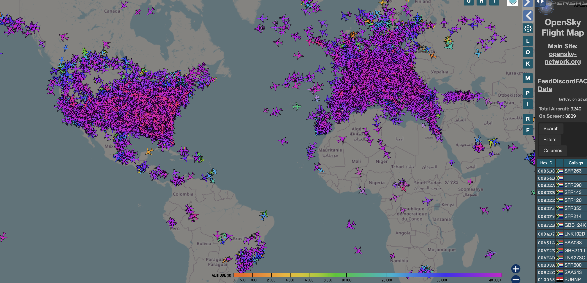

# Tráfico Aéreo en Tiempo Real con OpenSky

## Bases de Datos No Relacionales | Equipo 3
| Nombre | Clave Única |
| :--- | :---: |
| Irene Escudero Cazarez | 000215698 |
| Maria Fernanda Leon Hernandez | 000000000 |
| Regina Maria Cortez Vera | 000000000 |
| Ricardo André Gorostieta Jurado | 000217746 |
| Victor Manuel Benitez Renteria | 000000000 |

## Enlaces a la API y documentación del stream

Documentación y recursos oficiales:

- **Documentación oficial de la REST API:**  
  https://opensky-network.org/apidoc/rest.html

- **Sitio oficial de OpenSky Network:**  
  https://opensky-network.org

- **Repositorio de documentación y ejemplos de uso:**  
  https://github.com/openskynetwork

- **Biblioteca Python para consumir la API:**  
  https://github.com/openskynetwork/opensky-api

---

## Descripción del stream de datos

El stream de datos utilizado en este proyecto proviene de la **OpenSky Network**, una red global de sensores que recolecta información transmitida por aeronaves mediante tecnología **ADS-B (Automatic Dependent Surveillance–Broadcast)** y **Mode-S**. Estas señales son emitidas periódicamente por los transpondedores de los aviones y contienen información sobre su estado de vuelo.

La plataforma OpenSky recopila estas señales desde miles de receptores distribuidos en todo el mundo y las pone a disposición a través de una API pública que permite consultar el estado actual de las aeronaves.

Cada evento dentro del stream corresponde a un **state vector** de una aeronave en un momento determinado. Un state vector describe el estado del avión e incluye múltiples atributos, entre ellos:

- Identificador único del avión (`icao24`)
- Callsign del vuelo
- País de origen del registro de la aeronave
- Posición geográfica (latitud y longitud)
- Altitud
- Velocidad
- Dirección o rumbo del vuelo
- Tasa de ascenso o descenso
- Timestamps de posición y último contacto

Estos datos permiten reconstruir la dinámica del tráfico aéreo global en tiempo casi real. El propósito de este stream es facilitar el análisis del comportamiento del tráfico aéreo, el estudio de patrones de vuelo, la detección de anomalías en trayectorias y el análisis espacial y temporal de la densidad de aeronaves en diferentes regiones.

En este proyecto, cada state vector se considera un **evento del stream**, lo que permite modelar el flujo de datos como una serie de observaciones temporales de aeronaves que pueden ser almacenadas y analizadas utilizando una arquitectura de bases de datos NoSQL.

## Resumen
El flujo de datos seleccionado para este proyecto consiste en un stream de "State Vectors" (vectores de estado) provenientes de la red global OpenSky. Cada evento capturado representa una actualización en tiempo real de la situación física de una aeronave, incluyendo su posición tridimensional, velocidad e identidad. A diferencia de un conjunto de datos estático, este stream nos permite observar la dinámica del transporte aéreo como un sistema vivo y en constante cambio.

En el contexto de nuestro proyecto de Bases de Datos No Relacionales, el objetivo es utilizar este flujo masivo para diseñar una arquitectura de extremo a extremo que sea escalable. El stream de OpenSky es ideal para este propósito ya que genera más de un evento por segundo, permitiéndonos poner a prueba una capa de ingesta de alta disponibilidad y una capa de procesamiento analítico donde transformaremos estos eventos crudos en información estratégica. El enfoque del equipo será demostrar cómo estos datos, una vez ingestados y enriquecidos, pueden revelar patrones de tráfico, saturación de rutas y comportamientos operativos mediante consultas complejas.

## Origen y Autoría
La información utilizada en este proyecto es recolectada, procesada y distribuida por The OpenSky Network, una organización de investigación científica sin fines de lucro con sede en Suiza. Este proyecto surgió en 2012 como una colaboración académica entre la Universidad de Kaiserslautern (Alemania), la Universidad de Oxford (Reino Unido) y armasuisse (Suiza).

A diferencia de los radares comerciales cerrados, la autoría y obtención de estos datos es comunitaria y colaborativa. El pilar tecnológico de esta red es el sistema ADS-B (Automatic Dependent Surveillance-Broadcast), el cual permite que las aeronaves determinen su propia posición y velocidad mediante GPS para después transmitirla periódicamente en la frecuencia de radio de 1090 MHz.

Para capturar esta información a gran escala, OpenSky opera una infraestructura masiva de receptores distribuidos por todo el mundo. Esta red se mantiene gracias al apoyo de voluntarios, socios industriales y organizaciones gubernamentales o académicas que alojan los sensores en sus propias ubicaciones. OpenSky actúa como el nodo central que cosecha estos datos vía Internet, estandariza las señales recibidas y las transforma en el formato estructurado de "State Vectors" que consumimos a través de su API para este análisis.

### Diccionario de Datos
El stream de OpenSky Network transmite el estado de aeronaves detectadas por la red de sensores ADS-B. Cada registro representa la información más reciente de una aeronave en un momento determinado.
| Atributo | Definición técnica | Tipo de dato |
|-----------|-----------|-----------|
|Hex ID  | Identificador único ICAO de la aeronave    | String    |
|Callsign| Identificador del vuelo asignado por la aerolínea    | String    |
|Route   | Ruta estimada del vuelo entre aeropuerto origen y destino   |  String  |
|Registration  |   Matrícula oficial de la aeronave  | String   |
|Type  | Modelo o tipo de aeronave   |  String  |
|Squawk   | Código transponder asignado por control de tráfico aéreo  |  Integer  |
|Alt (ft)	| Altitud actual de la aeronave	| Numérico (pies) |
|Spd (kt)	| Velocidad horizontal del avión	| Numérico (knots) |
|V. Rate (ft/min) |	Tasa de ascenso o descenso del avión	| Numérico (pies/minuto) |
|Dist (nm)	| Distancia estimada respecto al receptor	| Numérico (millas náuticas) |
|Track |	Dirección de movimiento del avión	| Numérico (grados) |
|Messages	| Número de mensajes ADS-B recibidos	| Integer |
|Seen	| Tiempo desde el último mensaje recibido |	Numérico (segundos) |
|RSSI	| Intensidad de señal recibida	Numérico (dB) |
|Latitude |	Latitud de la aeronave	| Numérico (grados) |
|Longitude	| Longitud de la aeronave	| Numérico (grados) |
|Source	| Tipo de fuente de datos (ej. ADS-B)	| String |
|Mil.	| Indicador de aeronave militar	| Boolean |
|Wind D.	| Dirección del viento estimada |	Numérico (grados) |
|Wind (kt)	| Velocidad del viento	| Numérico (knots)|

### Variables Cuantitativas
Las variables cuantitativas corresponden a atributos numéricos que describen el estado físico y dinámico de las aeronaves.
Entre ellas se encuentran:
- Alt (ft) – altitud de vuelo
- Spd (kt) – velocidad del avión
- V. Rate (ft/min) – velocidad vertical
- Dist (nm) – distancia respecto al receptor
- Track – dirección de desplazamiento
- Latitude – coordenada geográfica de latitud
- Longitude – coordenada geográfica de longitud
- Messages – número de mensajes recibidos
- Seen – tiempo desde el último contacto
- RSSI – intensidad de señal
- Wind D. – dirección del viento
- Wind (kt) – velocidad del viento
- Estas variables permiten analizar patrones de tráfico aéreo, velocidad, altitud, trayectoria y condiciones ambientales del vuelo.

## Variables Cualitativas
Las variables cualitativas que corresponden a esta base de datos donde se representan grupos o identidades fijas son: 
- icao24 - identificador único y permanente de cada transpondedor de la aeronave
- callsign - código de identificación del vuelo (identifica la operación actual)
- origin_country - ubicación de registro de la aeronave
- on_ground - categoría dicotómica: true o false
- posicion_source - origen de los datos
- category - tipo de vehiculo según su peso

## Texto No Estructurado
Los sistemas de control de tráfico aereo requieren datos altamente estructurados y ligeros para ser transmitidos por radiofrecuencia. En general, el texto no estructurado es inexistente en la transmisión de estos datos en vivo. Existe un campo llamado 'sensors' que es una lista de IDs que se refieren a la red de receptores terrestres que escuchan las transmisiones de las aeronaves que podría ser lo más parecido a el texto no estructurado, sin embargo, este no se trata de un texto libre, si no, es una lista de códigos. 

## Series Temporales
La API-Rest de Open sky no cuenta con series temporales como tal. Funciona a base de snapshots, pequeñas capturas que reflejan el momento (timestamp) cuando la aeronave ha hecho contacto. Ademas de esto, la API cuenta propiamente con la opcion de filtrar mediante lapsos de tiempo, con un maximo de dos goras, donde filtra mediante los tiempos registrados en las snapshots que se empatan con el intervalo seleccionado.

## Consideraciones Éticas

El procesamiento de datos de vigilancia aérea, aunque se basa en señales públicas (ADS-B), conlleva responsabilidades éticas y riesgos de sesgo que el equipo debe considerar:
- Seguimiento de Individuos: El uso de icao24 para rastrear aeronaves privadas de forma persistente puede derivar en problemas de privacidad. Nuestro enfoque se limita al análisis de flujos agregados y patrones de tráfico, evitando el monitoreo de objetivos individuales.

- La red OpenSky depende de receptores voluntarios (crowdsourcing). Esto genera un sesgo de disponibilidad: las regiones con mayor infraestructura tecnológica (Europa y Norteamérica) presentan una densidad de datos artificialmente superior a la de regiones en desarrollo. Es éticamente necesario aclarar que la ausencia de datos en ciertas zonas no implica falta de tráfico, sino falta de sensores.

- Al ser una organización sin fines de lucro enfocada en la investigación, el uso ético de estos datos implica respetar los términos de servicio para fines académicos. Existe el riesgo de que análisis erróneos o interpretaciones simplistas de anomalías en el stream generen alarmas innecesarias sobre la seguridad aérea.
